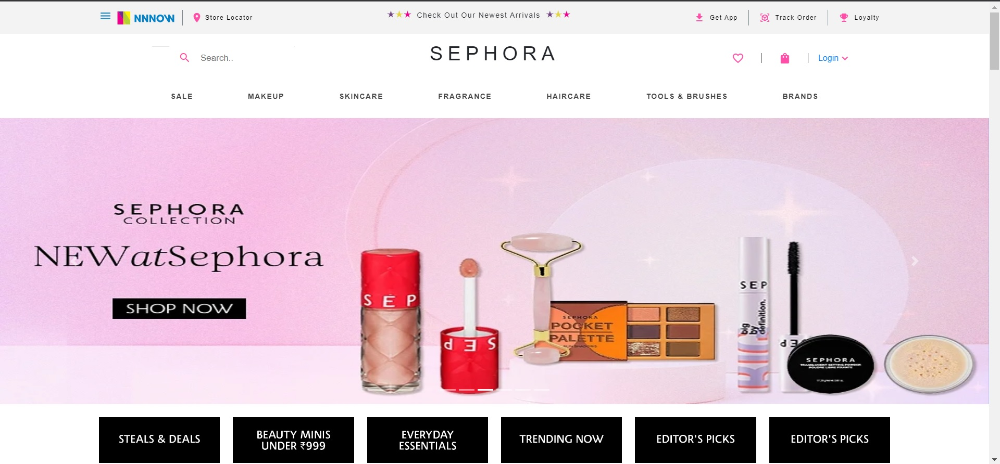
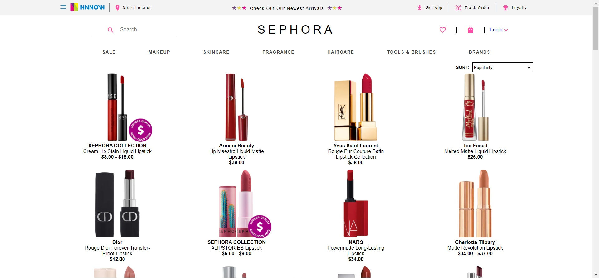
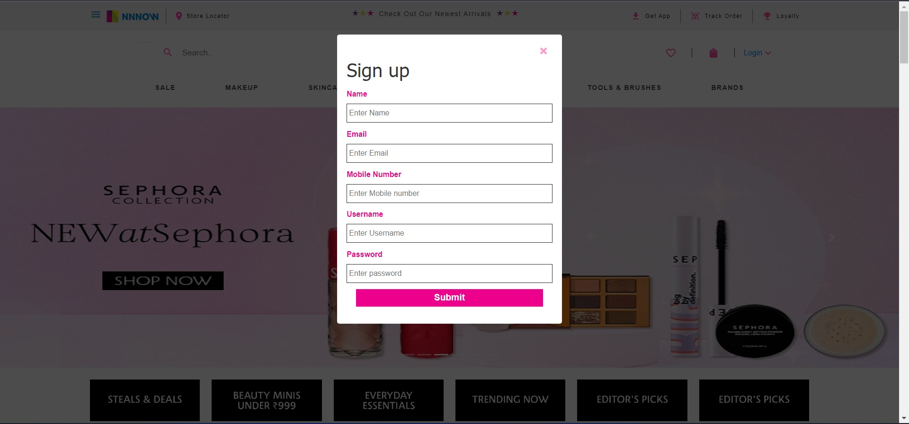
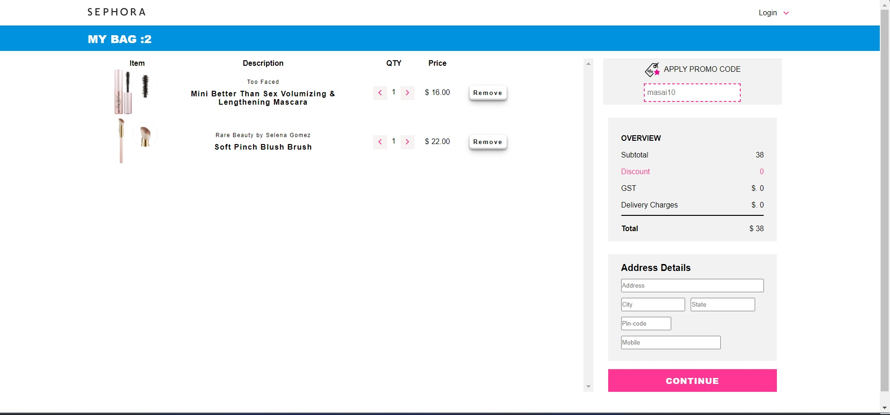
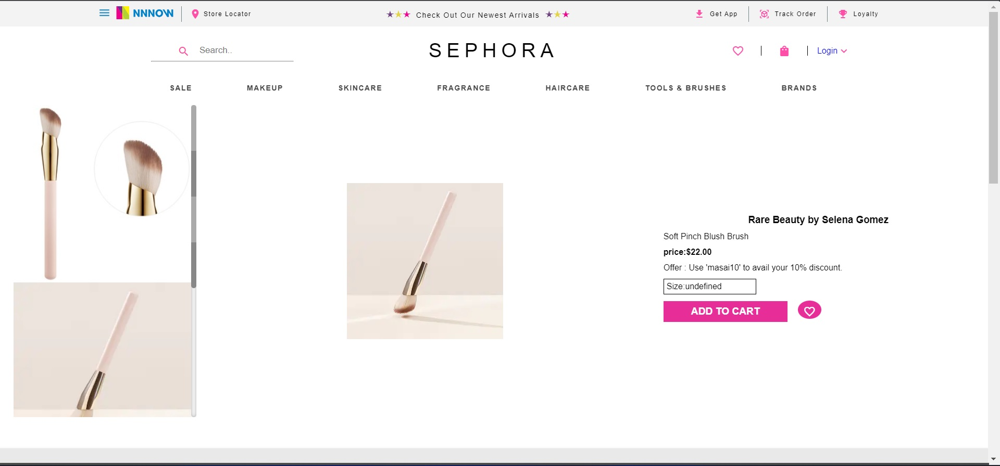

# Sephora Clone [ Collaborative Project  ]

Sephora is a French multinational retailer of personal care and beauty products. Featuring nearly 340 brands, along with its own private label, Sephora Collection, Sephora offers beauty products including cosmetics, skincare, body, fragrance, nail color, beauty tools, body lotions and haircare. 

AS part of unit 2 construct week we cloned the frontend of sephora.com to the best of our ability in a team of 6 within the span of 5 days.

[Deploy link](https://tourmaline-taiyaki-83e0f5.netlify.app/index.html)

## collaborators:
- [Anshuman Singh](https://github.com/asr0212)
- [Vivek Nemade](https://github.com/VivekN11)
- [Shubham Pawar](https://github.com/shubhampawar0901)
- [Ashutosh Vishwakarma](https://github.com/ashutoshvish07)
- [Vedant Pawar](https://github.com/vedantpawar18)
- [Shubham Kumar](https://github.com/alluShubham)

## Tech Stack:

   
   
   
   

## Features:
1. Signin/Signup
2. Product Discovery Page
3. Product Cart and Checkout Page
4. Payment gateway Integration 

## Try it out locally
This is a simple project. You can use any server to serve up the html pages. Once the server is runnning just go to the localhost link the server provides.

<h1>Snapshots of our project</h1>

1. This is the Landing page of Sephora

2.This is Brands Page

3.This is Sign-up and Sign IN Page

4. This is the basket.

4. Per Product.

